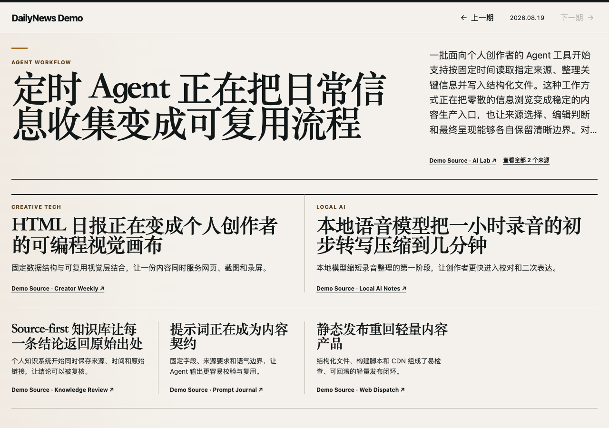

# DailyNews

让你自己的 AI Agent 搜集和整理内容，再把结果编排成一份可阅读、可分享、可定制主题的数字日报。



当前版本是 `v0.9.0`。它是一个文件驱动的本地版本：Agent 只提交声明式内容或主题候选，Node.js 负责校验、正式写入和确定性编排，前端按固定的四格报纸骨架展示结果。

## 主要能力

- 一条内容对应一个模块，按 `lead`、`important`、`normal` 编译为大、中、小三档版面。
- 桌面端使用四格拼装布局，移动端保持原阅读顺序转换为单列。
- 支持一条内容关联多个来源，并通过共享来源面板查看。
- 内置 `newspaper-default`、`swiss-editorial`、`midnight-tech` 三个可切换主题。
- AI Agent 可以通过受约束的 JSON Candidate 写内容或定制主题，不直接生成 HTML、CSS 和版面坐标。
- 可以构建为纯静态文件并部署到普通静态站点。

当前版本只处理纯文字日报，不包含账号、远程 MCP、图片、服务端 Agent 调度或偏好推荐。

## 快速开始

需要：

- Git
- Node.js 22 或更高版本

项目没有第三方运行时依赖，克隆后可以直接启动：

```bash
git clone https://github.com/dingshuxin353/daily-news-app.git
cd daily-news-app
npm start
```

打开 <http://127.0.0.1:4173>。如需修改本地端口：

```bash
PORT=5173 npm start
```

启动前会校验站点配置、当前主题和正式日报，并重新生成 `data/compiled/` 与 `data/index.json`。
新克隆默认不附带日报数据，因此第一次打开会显示“暂无日报”；让 Agent 生成第一份 Candidate 并由宿主处理后即可看到日报。

## 第一次配置

编辑 [`config/site.json`](./config/site.json)，可以修改站点名称、强调色、可选 Logo 和三档内容数量上限：

```json
{
  "name": "我的 AI 日报",
  "accentColor": "#F2B84B",
  "priorityLimits": {
    "lead": 1,
    "important": 2,
    "normal": null
  }
}
```

`null` 表示不限，非负整数表示最大数量。所有配置字段和文件规则见 [`docs/CONFIGURATION.md`](./docs/CONFIGURATION.md)。

## 让 Agent 写日报

把仓库目录交给支持本地文件读写的 Agent，然后使用类似下面的任务描述：

```text
请先阅读仓库根目录的 AGENTS.md 和 AGENT_CONTENT_GUIDE.md，
根据我指定的内容源生成今天的 DailyNews Candidate。
只写候选文件，不直接修改正式日报或编译产物。
```

Agent 的唯一内容产物是：

```text
data/candidates/YYYY-MM-DD.json
```

Agent 写完即可结束。随后由用户、自动化任务或其他宿主环境消费候选：

```bash
npm run process-candidate -- --candidate data/candidates/YYYY-MM-DD.json --mode update
```

默认只允许处理当前上海日期。修订历史日期时追加 `--allow-history`；只有明确需要完整替换时才使用 `--mode replace`。

Candidate 字段、来源规则、去重方式和 Agent 完成条件见 [`AGENT_CONTENT_GUIDE.md`](./AGENT_CONTENT_GUIDE.md)。

## 切换或定制主题

查看当前主题和已经保存的主题：

```bash
npm run list-themes
```

切换已有主题：

```bash
npm run switch-theme -- --theme swiss-editorial --confirm swiss-editorial
```

让 Agent 新增或修改主题时，可以使用：

```text
请先阅读仓库根目录的 AGENTS.md 和 AGENT_THEME_GUIDE.md，
根据我的风格要求生成一个 Theme Candidate。
只写 themes/candidates/ 下的候选文件，不直接覆盖正式主题或当前配置。
```

Agent 写完 Candidate 后即可结束。支持本地命令的宿主或维护者可以继续处理：

```bash
npm run process-theme -- --candidate themes/candidates/<theme-id>.json
```

运行 `npm start` 后，通过 `/?themePreview=<theme-id>` 查看真实日报预览。用户确认后再激活：

```bash
npm run activate-theme -- --theme <theme-id> --confirm <theme-id>
```

主题字段、允许值和 Agent 边界见 [`AGENT_THEME_GUIDE.md`](./AGENT_THEME_GUIDE.md)。

## 数据与目录

| 路径 | 作用 | 维护者 |
| --- | --- | --- |
| `config/site.json` | 站点设置和内容数量上限 | 用户 |
| `config/theme.json` | 当前主题选择 | 主题命令 |
| `data/candidates/` | 日报 Candidate | Agent |
| `data/issues/` | 正式日报事实 | Issue Writer |
| `data/compiled/` | 前端渲染数据 | Layout Compiler |
| `themes/candidates/` | 主题 Candidate | Agent |
| `themes/definitions/` | 持久主题库 | Theme Writer |
| `themes/compiled/` | 编译后的主题 CSS | Theme Compiler |
| `themes/active.json` | 当前主题运行时清单 | 主题命令 |

不要手工修改生成目录来绕过 Writer、Compiler 或主题命令。

## 构建与部署

```bash
npm test
npm run build
```

构建成功后，完整静态站点位于 `dist/`。把该目录中的全部文件部署到任意能够按原路径提供 HTML、JavaScript、CSS 和 JSON 的静态站点即可。

## 文档入口

| 文档 | 读者 | 用途 |
| --- | --- | --- |
| [`AGENTS.md`](./AGENTS.md) | AI Agent | 判断任务类型和允许修改的路径 |
| [`AGENT_CONTENT_GUIDE.md`](./AGENT_CONTENT_GUIDE.md) | 内容 Agent | 生成日报 Candidate |
| [`AGENT_THEME_GUIDE.md`](./AGENT_THEME_GUIDE.md) | 主题 Agent | 查看、切换或生成主题 Candidate |
| [`docs/CONFIGURATION.md`](./docs/CONFIGURATION.md) | 用户与维护者 | 配置站点、主题和运行方式 |
| [`CONTRIBUTING.md`](./CONTRIBUTING.md) | 贡献者与开发 Agent | 分支、提交、审查、验证和目录规则 |

## 开发验证

```bash
npm test
npm run build
node --check src/app.js
git diff --check
```

v0.9.0 已通过桌面、移动端、三个官方主题、压力日报、键盘焦点和无 JavaScript 退化检查。临时测试产物不保存在源码仓库。

## 开源许可

本项目使用 [MIT License](./LICENSE)。
